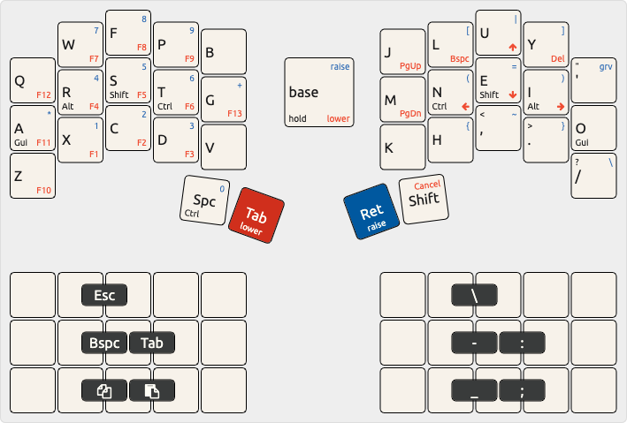

# QMK Userspace

This is my personalised configuration for small, split keyboards like the [Corne](https://github.com/foostan/crkbd). It works on larger splits like the [Ergodox](https://ergodox-ez.com/) but doesn't use all the keys.

For a nearly identical experience in with ZMK, see my [zmk-config](https://github.com/mforman/zmk-config)

## Layout



## Tap vs Hold

In the diagram above, what's printed in the middle of the key is what you get when you tap the key. What's printed in the lower left is what you get when you hold them key. These are modifier keys like `cmd` and `shift`.

For example, the key on your left thumb is `space` when pressed, but activates `CONTROL` when held.

### Reference

-   [preconditon - A guide to home row modes](https://precondition.github.io/home-row-mods)
-   [Achordion: Customizing the tap-hold descision](https://getreuer.info/posts/keyboards/achordion/index.html) - IMO homerow mods are frustrating without this.

## Layers

There are only 34 keys used by the layout. With so many fewer keys, we rely on layers to fit everything in. It sounds complicated, but you get used to it pretty quickly.

Everyone already knows about one layer: the `SHIFT` layer.
When you hold `SHIFT`, you get `$` instead of `4` or `D` instead of `d`.

This keyboard layout adds 3 more layers, but you'll mainly use two of them - `RAISE` and `LOWER`. The third is `ADJUST`.

### Raise Layer

Holding down the inner thumb key on the right hand actives the `RAISE` layer. The main thing you get here is a number pad on your left hand and symbols on the right hand. 

It also give you modifiers under your right hand on the home row.

Using the `D` as an example:

-   On it's own, you get `d`
-   Holding down `enter` to activate `RAISE` you get `5`
-   Holding down `enter` and holding `K` (for `SHIFT`) you get `%`

The `RAISE` layer keys are shown in <span style="color: blue">blue</span> in the top-right corner of the key in the diagram

### Lower Layer

Similar to `RAISE` holding down the big thumb key on the left hand activates the `LOWER` layer.

The main thing found on this layer is the arrow key and other navigation keys (page up/down, home/end). Arrows are one the home row of the right hand. `J` becomes `left`, `K` becomes `down`, etc.

You have the same home-row modifiers under the left hand that you have on the right with `RAISE`, but the `LOWER` layer also includes the F keys in the same place as the number pad.

The `LOWER` layer keys are shown in <span style="color: red">red</span> in the lower-right corner of the key in the diagram

### Adjust Layer

Finally, there are a few other less-frequently used keys on a final layer, `ADJUST`. This is activated by hold both inner thumb keys at the same time. Here you have media control on the home row of the right hand.
-   `P` resets the keyboard and enters flashing mode so you can change the firmware.

The right hand of the `ADJUST` layer controls RGB light effects

-   `A` toggles the lights
-   `Q` cycles through the lighting effects

## Combos

In addition to all the layers, pressing two (or three) keys at the same time, triggers a different key. For me, these are the most powerful feature of the keyboard.

-   `W`+`F` = `Esc`
-   `W`+`P` = Toggle mouse layer
-   `R`+`S` = `Backspace`
-   `A`+`R`+`S` = Delete the previous word
-   `S`+`T` = `Tab`
-   `L`+`U` = `\`
-   `N`+`E` = `-`
-   `E`+`I` = `:`
-   `H`+`,` = `_`
-   `,`+`.` = `;`

## Howto configure your build targets

1. Run the normal `qmk setup` procedure if you haven't already done so -- see [QMK Docs](https://docs.qmk.fm/#/newbs) for details.
1. Fork this repository
1. Clone your fork to your local machine
1. Enable userspace in QMK config using `qmk config user.overlay_dir="$(realpath qmk_userspace)"`
1. Add a new keymap for your board using `qmk new-keymap`
    - This will create a new keymap in the `keyboards` directory, in the same location that would normally be used in the main QMK repository. For example, if you wanted to add a keymap for the Planck, it will be created in `keyboards/planck/keymaps/<your keymap name>`
    - You can also create a new keymap using `qmk new-keymap -kb <your_keyboard> -km <your_keymap>`
    - Alternatively, add your keymap manually by placing it in the location specified above.
    - `layouts/<layout name>/<your keymap name>/keymap.*` is also supported if you prefer the layout system
1. Add your keymap(s) to the build by running `qmk userspace-add -kb <your_keyboard> -km <your_keymap>`
    - This will automatically update your `qmk.json` file
    - Corresponding `qmk userspace-remove -kb <your_keyboard> -km <your_keymap>` will delete it
    - Listing the build targets can be done with with `qmk userspace-list`
1. Commit your changes

## Howto build with GitHub

1. In the GitHub Actions tab, enable workflows
1. Push your changes above to your forked GitHub repository
1. Look at the GitHub Actions for a new actions run
1. Wait for the actions run to complete
1. Inspect the Releases tab on your repository for the latest firmware build

## Howto build locally

1. Run the normal `qmk setup` procedure if you haven't already done so -- see [QMK Docs](https://docs.qmk.fm/#/newbs) for details.
1. Fork this repository
1. Clone your fork to your local machine
1. `cd` into this repository's clone directory
1. Set global userspace path: `qmk config user.overlay_dir="$(realpath .)"` -- you MUST be located in the cloned userspace location for this to work correctly
    - This will be automatically detected if you've `cd`ed into your userspace repository, but the above makes your userspace available regardless of your shell location.
1. Compile normally: `qmk compile -kb your_keyboard -km your_keymap` or `make your_keyboard:your_keymap`

Alternatively, if you configured your build targets above, you can use `qmk userspace-compile` to build all of your userspace targets at once.

## Extra info

If you wish to point GitHub actions to a different repository, a different branch, or even a different keymap name, you can modify `.github/workflows/build_binaries.yml` to suit your needs.

To override the `build` job, you can change the following parameters to use a different QMK repository or branch:

```
    with:
      qmk_repo: qmk/qmk_firmware
      qmk_ref: master
```

If you wish to manually manage `qmk_firmware` using git within the userspace repository, you can add `qmk_firmware` as a submodule in the userspace directory instead. GitHub Actions will automatically use the submodule at the pinned revision if it exists, otherwise it will use the default latest revision of `qmk_firmware` from the main repository.

This can also be used to control which fork is used, though only upstream `qmk_firmware` will have support for external userspace until other manufacturers update their forks.

1. (First time only) `git submodule add https://github.com/qmk/qmk_firmware.git`
1. (To update) `git submodule update --init --recursive`
1. Commit your changes to your userspace repository
